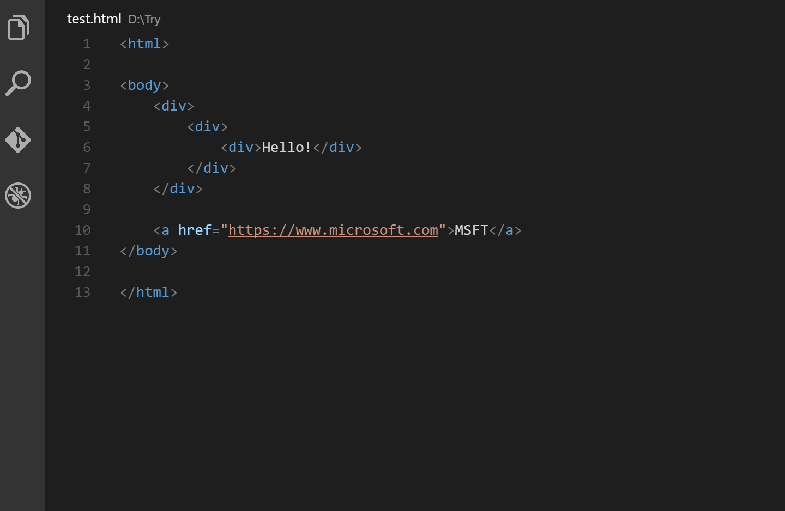
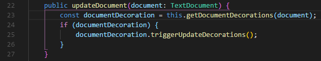
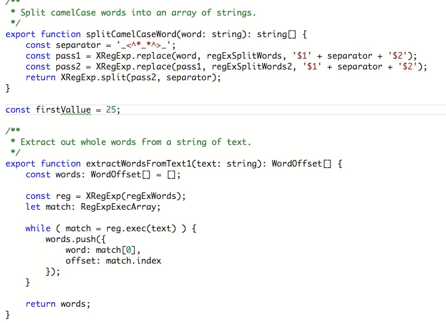
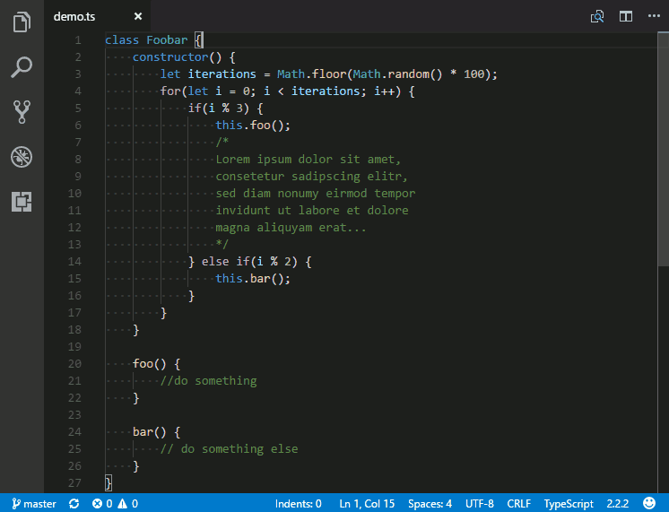
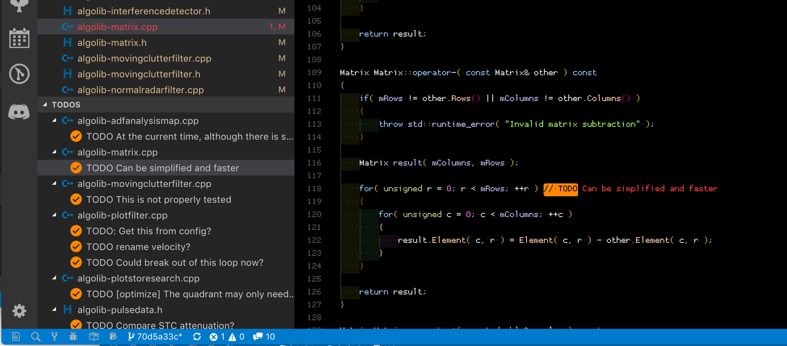

# README
These are safe extension that won't take away from learning things the hard
way. My justification for not making a student's life too easy is depending
on a technical interview method, one may not have access to their VS Code setup
and should be able to still code

Besides for extensions that are for the front end, the rest of the extensions
should be language agnostic.

Feel like an extension should be added or removed? Feel free to open an issue
on the github repo

## List of included extensions:

1. [Auto Rename-Tag](https://marketplace.visualstudio.com/items?itemName=formulahendry.auto-rename-tag)
   - Easily rename html/jsx tags
   - 
2. [Bracket Pair Colorizer 2](https://marketplace.visualstudio.com/items?itemName=CoenraadS.bracket-pair-colorizer-2)
   - This will make brackets be colorized so that you can easily visually find
   the matching closing bracket for every open bracket or find ones that are
   missing their closing bracket
   - Brackets are - [], (), {}
   - By default it cycles through three colors, you can add more
   - 
3. [Code Spell Checker](https://marketplace.visualstudio.com/items?itemName=streetsidesoftware.code-spell-checker)
   - A basic spell checker that works with programming including in camelCase
     or snake case variable names
   - Make your comments & variable more professional due to the lack of
     spelling errors
   - If you are like me, staring at code often makes me question the spelling of things, and having this gives me a sanity check
   - 
4. [indeticator](https://marketplace.visualstudio.com/items?itemName=SirTori.indenticator) -
  Visually highlights the current indent depth
   - 
5. [Live Server](https://marketplace.visualstudio.com/items?itemName=ritwickdey.LiveServer)
   - When you work on a plain website, using VS Code, this will
     cause the browser to auto-refresh every time you save your
     work. This way you can see your latest changes quicker
6. [Live Share](https://marketplace.visualstudio.com/items?itemName=MS-vsliveshare.vsliveshare)
   - Share your VS Code session including the codebase and/or locally running terminal, you can even when configured, access a running web server
   - Useful for when working with instructors, mentors, or even when pair-coding remotely
   - Every participant gets to use their VS Code, with THEIR font size, font, colors ect. Way better than screen sharing for this reason
7. [Todo Tree](https://marketplace.visualstudio.com/items?itemName=Gruntfuggly.todo-tree)
   - Make a todo list, inside of VS Code based on your code comments!
   - This will work with comments that contain the word `TODO` or `FIXME`
   - Useful for your assignments, and portfolio projects
   - 
